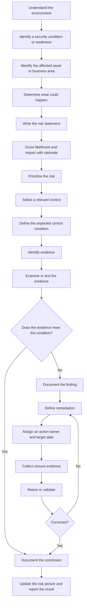

# Federal Zero Trust GRC Portfolio

**IT Risk Assessment, Control Testing, Evidence Review, and Remediation**

This portfolio demonstrates an IT risk and control assessment workflow using a fictional civilian federal environment.

The project focuses on the GRC work most relevant to risk and control-assessment roles: identifying and prioritizing risk, mapping risks to security controls, defining evidence expectations, assessing control effectiveness, documenting exceptions, and tracking remediation through validation.

NIST SP 800-53 Rev. 5 is the primary control framework. NIST SP 800-37, NIST SP 800-53A, NIST SP 800-207, and the CISA Zero Trust Maturity Model are supporting references where they fit the work shown here.

## What this portfolio shows

- risk identification and prioritization
- NIST SP 800-53 Rev. 5 control mapping
- risk scoring with written rationale
- evidence planning
- one control assessment using synthetic access data
- remediation tracking through a POA&M-style artifact
- remediation validation and closure through a scoped retest
- policy requirements and a limited Zero Trust crosswalk

## Reasoning flow



The main point is simple: evidence is not proof by itself. I have to compare it with an expected condition before I can support a control conclusion or finding.

## Current portfolio snapshot

- **Risks identified:** 5
- **High inherent risks:** 4
- **POA&M items:** 5 (1 closed, 4 open)
- **Evidence requirements defined:** 8
- **Control assessments:** 1
- **Completed remediation retests:** 1
- **Access review exceptions:** 2 (remediated and retested)

## Artifacts

| # | Artifact | What it shows |
|---|---|---|
| 00 | [Portfolio Overview](artifacts/00-portfolio-overview.md) | Scenario, scope, framework use, and methodology |
| 01 | [Executive Risk Summary](artifacts/01-executive-risk-summary.md) | Priority risks, business impact, and recommended actions |
| 02 | [Risk Register](artifacts/02-risk-register.csv) | Risk statements, scores, rationale, treatment, owners, and evidence needs |
| 02A | [Risk Scoring Guide](artifacts/02-risk-scoring-guide.md) | 5x5 scoring method and rating thresholds |
| 03 | [Control Mapping Matrix](artifacts/03-control-mapping-matrix.csv) | Risk-to-control mapping, expected implementation, evidence, and status |
| 03A | [Control Mapping Method](artifacts/03-control-mapping-method.md) | How I selected controls and traced them to evidence and remediation |
| 04 | [POA&M-Style Remediation Tracker](artifacts/04-poam-remediation-tracker.csv) | Findings, source, milestones, owners, dates, and closure evidence |
| 04A | [POA&M Method](artifacts/04-poam-method.md) | Remediation and closure logic |
| 05 | [Security Control Policy](artifacts/05-security-control-policy.md) | Control requirements and responsibilities for the scenario |
| 06 | [Evidence Checklist](artifacts/06-evidence-checklist.csv) | Expected control conditions, evidence artifacts, and validation methods |
| 07 | [Access Review Evidence](artifacts/07-synthetic-access-review.csv) | Synthetic account and group data used in the initial assessment |
| 07A | [Control Assessment](artifacts/07-control-assessment.md) | Scoped AC-6 assessment criteria, exceptions, conclusion, and remediation traceability |
| 08 | [Remediation Retest Evidence](artifacts/08-synthetic-access-retest.csv) | Updated synthetic evidence for the two corrected access exceptions |
| 08A | [Retest and Validation](artifacts/08-retest-validation.md) | Remediation validation, scoped retest conclusion, and POAM-001 closure |

## Example: R-001 from risk to closure

```text
R-001 Excessive user access
        ↓
AC-6 Least Privilege
        ↓
Expected condition: access matches approved role
        ↓
Synthetic access evidence
        ↓
2 of 12 records contain unsupported access
        ↓
Initial assessment: Other Than Satisfied
        ↓
POAM-001
        ↓
Unsupported access removed
        ↓
Updated evidence reviewed and affected accounts retested
        ↓
2 of 2 retest records pass
        ↓
Scoped remediation validation: Satisfied
        ↓
POAM-001 Closed
```

## Residual risk

Residual risk is revisited only after the relevant controls are implemented and validated across the intended scope. Closing one scoped finding does not establish the residual risk of the broader environment.
