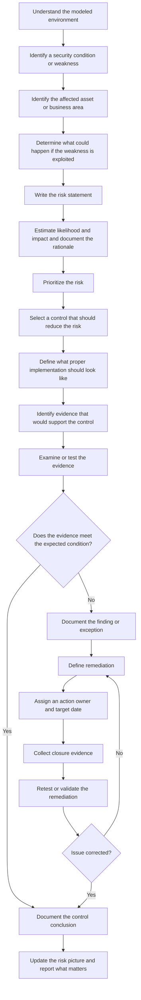

# Federal Zero Trust GRC Portfolio

A graduate capstone-derived governance, risk, and compliance portfolio modeling unauthorized-access risk in a fictional civilian federal environment.

The project translates academic cybersecurity work into practical GRC deliverables: risk identification, control mapping, remediation tracking, policy development, evidence planning, and one modeled control assessment.

> **Portfolio demonstration only.** This repository contains no sensitive, proprietary, or real federal agency data. It represents academic/portfolio work, not professional federal GRC experience.

## Scenario

The modeled environment includes internal users, privileged administrators, remote access users, application servers, file shares, logging systems, backup systems, network infrastructure, and segmented network zones.

The security objective is to reduce unauthorized access and data exposure through controls across identity, access governance, privileged access, network segmentation, remote access, logging, and backup validation.

## Frameworks used

**Primary control framework**

- NIST SP 800-53 Rev. 5

**Supporting references and concepts**

- NIST SP 800-37 Rev. 2 Risk Management Framework concepts
- NIST SP 800-53A Rev. 5 assessment methods
- NIST SP 800-207 Zero Trust Architecture
- CISA Zero Trust Maturity Model

NIST SP 800-53 is the main control framework used in the artifacts. The Zero Trust references are used to explain selected identity, network, visibility, and governance themes. This is not a full Zero Trust maturity assessment or a complete federal RMF package.

## Portfolio snapshot

- **Risks identified:** 5
- **High risks:** 4
- **POA&M items:** 5
- **Evidence items:** 8
- **Modeled control assessments:** 1
- **Modeled access-review exceptions:** 2
- **Primary control framework:** NIST SP 800-53 Rev. 5

## How I reasoned through the work

The artifacts are meant to follow one decision path rather than exist as separate templates.



The key bridge is the assessment step. Evidence is not useful just because it exists. It has to be compared with an expected control condition before it supports a conclusion or finding.

## Artifacts

| # | Artifact | What it demonstrates | Related GRC / RMF activity |
|---|---|---|---|
| 00 | [Portfolio Overview](artifacts/00-portfolio-overview.md) | Project scope, framework use, Zero Trust relationship, and artifact flow | Context and planning |
| 01 | [Executive Risk Summary](artifacts/01-executive-risk-summary.md) | Leadership-facing priorities, business impact, recommended actions, and current risk position | Risk communication |
| 02 | [Risk Register](artifacts/02-risk-register.csv) | Risk statements, assets, threats, vulnerabilities, scoring rationale, treatment, ownership, and evidence needs | Risk assessment and prioritization |
| 02A | [Risk Scoring Guide](artifacts/02-risk-scoring-guide.md) | 5×5 likelihood/impact method and rating thresholds | Risk analysis |
| 03 | [Control Mapping Matrix](artifacts/03-control-mapping-matrix.csv) | Risk-to-control mapping, implementation expectations, evidence needs, owners, status, and assessment traceability | Control selection and planning |
| 03A | [Control Mapping Method](artifacts/03-control-mapping-method.md) | Method used to select controls and define implementation/evidence expectations | Control planning |
| 04 | [POA&M-Style Remediation Tracker](artifacts/04-poam-remediation-tracker.csv) | Findings, milestones, action owners, target dates, status, and closure evidence | Remediation tracking and monitoring |
| 04A | [POA&M Method](artifacts/04-poam-method.md) | Remediation flow and status definitions | Remediation management |
| 05 | [Security Control Policy](artifacts/05-security-control-policy.md) | Governance requirements for access, segmentation, remote access, logging, backup validation, and exceptions | Policy and control requirements |
| 06 | [Evidence Checklist](artifacts/06-evidence-checklist.csv) | Evidence requirements, validation methods, owners, and review frequency | Assessment planning |
| 07 | [Modeled Access Review Evidence](artifacts/07-modeled-access-review.csv) | A small synthetic population used to test role-based access | Assessment evidence |
| 07A | [Modeled Control Assessment](artifacts/07-control-assessment.md) | Test criteria, procedure, exceptions, conclusion, and remediation traceability | Control assessment |

## Risk themes

1. Excessive user access beyond role requirements
2. Weak privileged access separation and monitoring
3. Insufficient internal network segmentation
4. Incomplete SIEM/logging coverage
5. Unvalidated backup and restore processes

## Selected Zero Trust relationship

| Existing portfolio work | Zero Trust relationship |
|---|---|
| User and privileged access reviews | Identity |
| Network zones, inter-zone controls, and remote access | Networks |
| SIEM/log source coverage and alert review | Visibility and Analytics |
| Risk register, policy, evidence planning, and POA&M tracking | Governance |

This table only shows where the existing work lines up with selected Zero Trust concepts. Devices, applications/workloads, data, automation/orchestration, and maturity levels are not fully assessed here.

## GRC workflow represented

```text
Identify condition
    ↓
Write and score risk
    ↓
Map relevant controls
    ↓
Define expected implementation
    ↓
Identify evidence
    ↓
Assess evidence against criteria
    ↓
Document conclusion or finding
    ↓
Track remediation and closure evidence
```

Residual risk is not assigned just because a control is planned. It should be reconsidered after there is evidence about control effectiveness and remediation status.

## Repository purpose

The repository is intentionally self-contained so the portfolio can be reviewed directly in GitHub without requiring access to the original Google Drive workspace. The source documents and spreadsheets remain the working originals; the files here are portfolio-readable representations of those artifacts.
