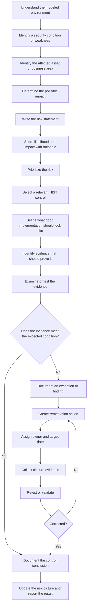

# 00 - Portfolio Overview

## Document control

| Field | Value |
|---|---|
| Document | Federal Zero Trust GRC Portfolio Overview |
| Project Type | Graduate Capstone-Derived GRC Portfolio Project |
| Author | Mark C. |
| Version | 1.1 |
| Disclaimer | For portfolio demonstration purposes only. This project is derived from a graduate cybersecurity capstone and does not contain sensitive, proprietary, or real federal agency data. |

## Project background

This portfolio focuses on unauthorized-access risk in a modeled civilian federal environment. The original academic project has been reorganized into practical GRC deliverables that show how a security condition can move from risk identification to control selection, evidence review, a finding, and remediation tracking.

The modeled domain includes internal users, privileged administrators, remote access users, application servers, file shares, logging systems, backup systems, network infrastructure, and segmented network zones.

## Portfolio purpose

The objective is to demonstrate entry-level GRC skills, including:

- risk identification and prioritization
- control mapping
- implementation expectations
- remediation tracking
- policy development
- evidence planning
- a modeled control assessment from evidence to conclusion

## Framework use

**Primary control framework**

- NIST SP 800-53 Rev. 5

**Supporting references and concepts**

- NIST SP 800-37 Rev. 2 Risk Management Framework concepts
- NIST SP 800-53A Rev. 5 assessment methods
- NIST SP 800-207 Zero Trust Architecture
- CISA Zero Trust Maturity Model

The portfolio does not claim to complete every RMF step or perform a full CISA Zero Trust maturity assessment. The frameworks are used where they directly support the work shown in the artifacts.

## Reasoning flow

The point of the flow is that evidence is not automatically proof. It has to be compared against an expected control condition before it supports a conclusion.

## Selected Zero Trust relationship

| Portfolio work | Zero Trust relationship |
|---|---|
| User access and privileged access | Identity |
| Segmentation, inter-zone traffic, and remote access | Networks |
| SIEM coverage and event review | Visibility and Analytics |
| Risk, policy, evidence, and remediation tracking | Governance |

This is a limited crosswalk of the work already in the portfolio. It is not a maturity score and it does not claim full coverage of the CISA model.

## Portfolio snapshot

- Risks Identified: 5
- High Risks: 4
- POA&M Items: 5
- Evidence Items: 8
- Modeled Control Assessments: 1
- Modeled Access Review Exceptions: 2
- Primary Control Framework: NIST SP 800-53 Rev. 5

## Portfolio deliverables

| Artifact | What it demonstrates | Related activity |
|---|---|---|
| Executive Risk Summary | Business impact, priorities, current risk position, and recommended actions | Risk communication |
| Risk Register | Risk statements, assets, threats, likelihood, impact, rationale, and treatment | Risk assessment |
| Control Mapping Matrix | Risks mapped to NIST 800-53 controls, implementation expectations, and evidence needs | Control planning |
| POA&M-Style Remediation Tracker | Findings, remediation actions, owners, dates, status, and closure evidence | Remediation tracking |
| Security Control Policy | Requirements for access, segmentation, remote access, monitoring, backup validation, and exceptions | Governance / policy |
| Evidence Checklist | Evidence needed to validate control operation and support assessment planning | Assessment planning |
| Modeled Access Review Evidence | Synthetic account and group data used for a small control test | Assessment evidence |
| Modeled Control Assessment | Criteria, procedure, exceptions, conclusion, and remediation traceability | Control assessment |

## What this portfolio does not claim

This is not a full federal authorization package. It does not include a complete system categorization, control baseline tailoring package, SSP, SAP, SAR, authorization decision, or continuous monitoring program.

The intent is narrower: show a defensible GRC reasoning chain and demonstrate that at least one control can be taken from expected evidence through an assessment conclusion and remediation action.
